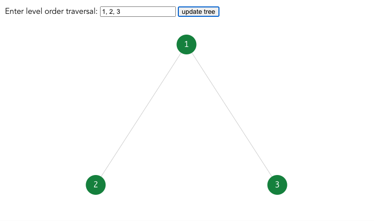
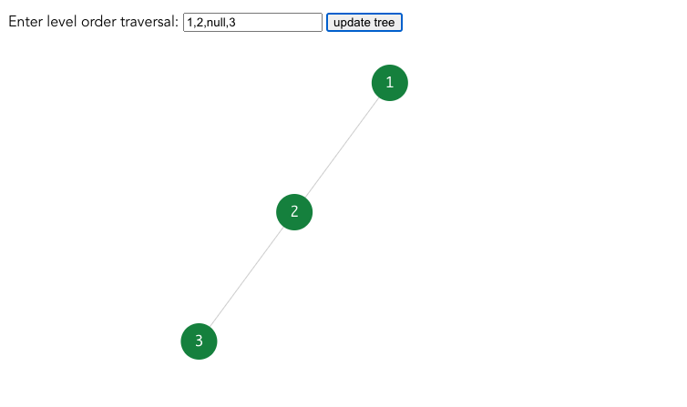
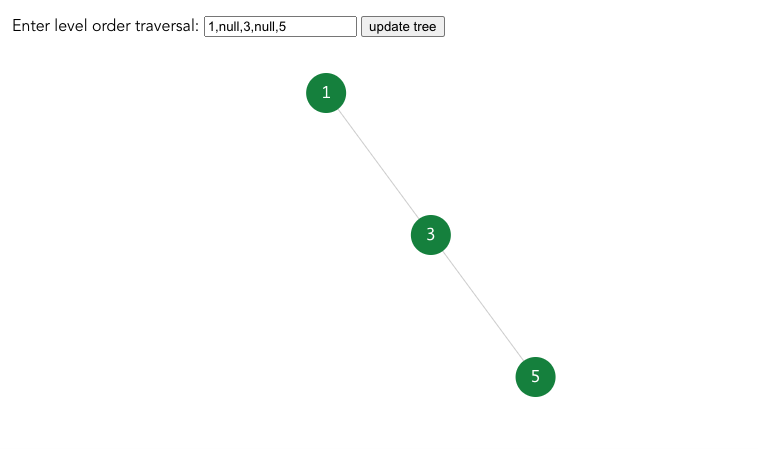
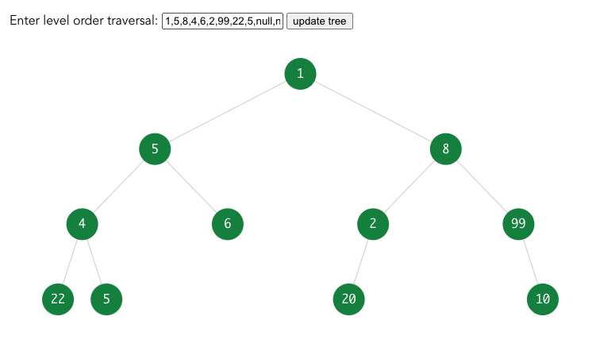

# Binary Tree Visualizer
Built with [d3](https://d3js.org/)  

## Feature
- Visualize a binary tree given a level-order-traversal string.
- Handle invalid level-order-traversal.

Try it out here: https://dyhrf.sse.codesandbox.io/

## Demo
  
  
  
  
